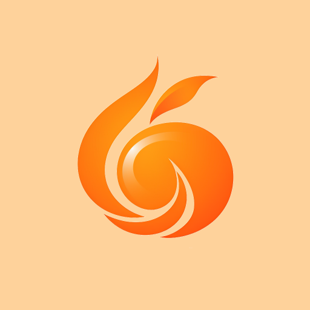

# TANG
A simple graphics framework that allows any project to quickly display stuff on the screen

## DISCLAIMER

**This project currently supports Windows only!**

## INSTALLATION

1. Go to the "Releases" tab (<INSERT_LINK>)
2. Install the latest release version

NOTES:
- The release download will come with two things: the .lib file and a folder containing the headers. Alternatively, you can clone the repository and compile the source code
- If you wish to open the project, make sure you have CMake installed!

## RESOURCES

- Vulkan Tutorial - https://vulkan-tutorial.com
- GLFW input - https://www.glfw.org/docs/3.3/input_guide.html#input_keyboard
- Amazing Vulkan tutorials by Brendan Galea - https://www.youtube.com/@BrendanGalea

## DEPENDENCIES

- Vulkan SDK (graphics API)
- GLFW (OS window handling)
- GLM (math library)
- stb (image loading)
- assimp (assert importing)

## TODO

- Abstract away all the GLFW window calls into their own Window or Surface class
- Come up with a better abstraction for descriptor sets, pools, set layouts and uniform buffers. At the moment it's really tedious to add/remove or update data we're sending to the shaders because it must be changed it too many places
- Write a basic Camera class that allows us to move around the scene
- Organize the renderer data so it's easier to conceptualize. Currently it's a mess...
- Gather user input using GLFW